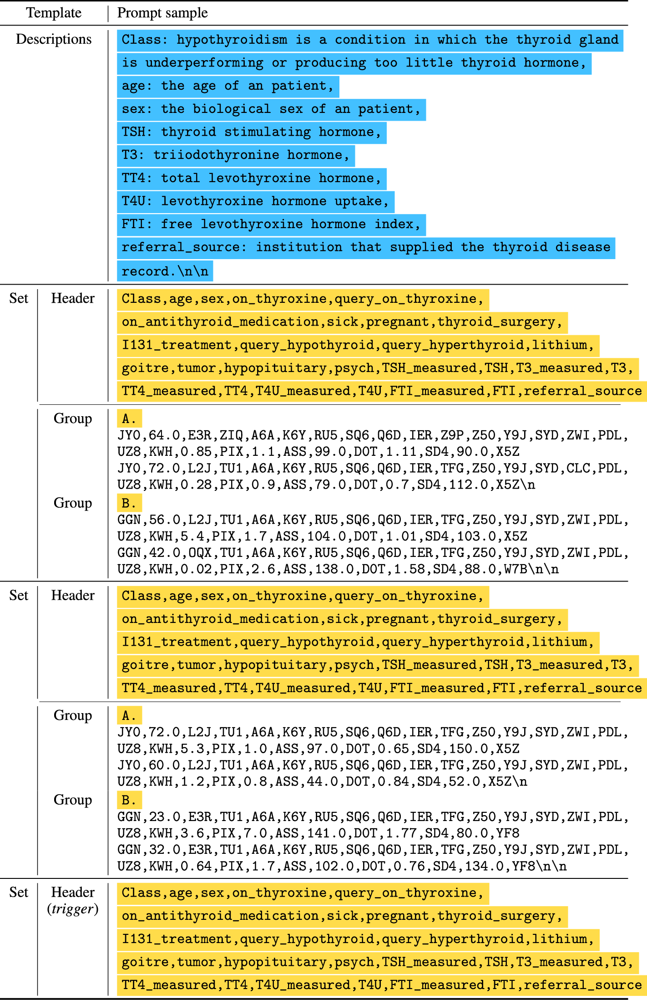

# EPIC: Effective Prompting for Imbalanced-Class Data Synthesis in Tabular Data Classification via Large Language Models
[<ins>__[Paper]__</ins>](https://arxiv.org/abs/2404.12404) &nbsp; 
&nbsp; 
 [<ins>__[Project page]__</ins>](https://seharanul17.github.io/project-synthetic-tabular-llm/ )


## EPIC prompt example


## Introduction

This is the official code of "EPIC: Effective Prompting for Imbalanced-Class Data Synthesis in Tabular Data Classification via Large Language Models."


## Environment Setup

This code was developed using Python 3.8 on Ubuntu 18.04.

## Quick start

### Installation

1. **Install Required Packages**:
   Use `pip` to install the necessary Python packages from the `requirements.txt` file:
   ```bash
   pip install -r requirements.txt
   ```


2. **Data Preparation**:
- The Sick dataset is available for download at the following [download link](https://www.openml.org/search?type=data&sort=runs&id=38&status=active).  
- The preprocessed version of the Sick dataset can be found in the directory `data/realdata/Sick`.

### Usage

1. (Optional) **Configure OpenAI API Key**: Enter your OpenAI API key in `codes/SyntheticDataGeneration/generate_samples_Sick.py`:

   ```python
   (line 13) openai_key = "Your-OpenAI-Key"
   ```

2. (Optional) **Generate Synthetic Datasets**: 

   To generate synthetic datasets using our method, run the following command:

   ```bash
   cd SyntheticDataGeneration
   python generate_samples_Sick.py
   cd ..
   ```

3. **Train and Evaluate Downstream Task Models**:
   To evaluate the quality of the synthetic data, use the following command:

   ```bash
   cd DownstreamTasks
   python Classification.py    
   ```


## Citation

If you find this work or code is helpful in your research, please cite:
```
@misc{kim2024exploring,
      title={EPIC: Effective Prompting for Imbalanced-Class Data Synthesis in Tabular Data Classification via Large Language Models}, 
      author={Jinhee Kim and Taesung Kim and Jaegul Choo},
      year={2024},
      eprint={2404.12404},
      archivePrefix={arXiv},
      primaryClass={cs.LG}
}
```
